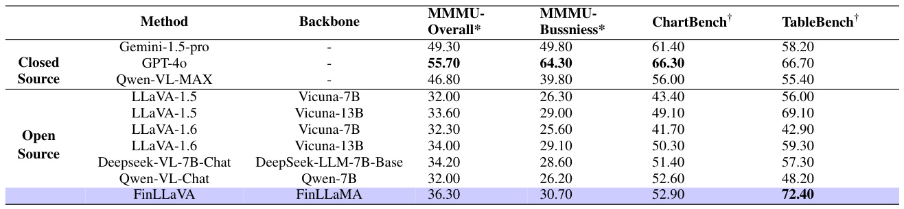
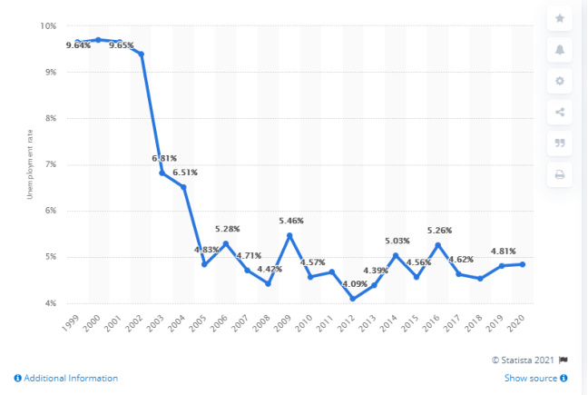

# Open-FinLLMs: Open Multimodal Large Language Models for Financial Applications  

Qianqian  $\mathbf{X}\mathbf{i}\mathbf{e}^{1}$  , Dong  $\mathbf{Li^{1}}$  , Mengxi Xiao 1 , Zihao Jiang 1 , Ruoyu Xiang 1 , Xiao Zhang 1 , Zhengyu Chen 1 , Yueru   $\mathbf{H}\mathbf{e}^{3}$  , Weiguang  $\mathbf{Han^{2}}$  , Yuzhe   $\mathbf{Yang^{4}}$  , Shunian Chen 4 , Yifei Zhang 5 , Lihang Shen 3 , Daniel  $\mathbf{K}\mathbf{i}\mathbf{m}^{6}$  , Zhiwei   $\mathbf{L}\mathbf{i}\mathbf{u}^{7}$  , Zheheng   $\mathbf{L}\mathbf{u}\mathbf{o}^{7}$  , Yangyang   $\mathbf{Y}\mathbf{u}^{8}$  , Yupeng   $\mathbf{Caa0^{8}}$  , Zhiyang Deng 8 , Zhiyuan  $\mathbf{Y}\mathbf{a}\mathbf{o}^{8}$  , Haohang  $\mathbf{Li^{8}}$  , Duanyu Feng 9 , Yongfu Dai 9 , VijayaSai Somasundaram 10 , Peng  $\mathbf{L}\mathbf{u}^{11}$  , Yilun Zhao 12 , Yitao Long 13 , Guojun Xiong 14 , Kaleb Smith 15 , Honghai  $\mathbf{Y}\mathbf{u}^{5}$  , Yanzhao Lai 1 , Min Peng 2 , Jianyun  $\mathbf{N}\mathbf{i}\mathbf{e}^{11}$  , Jordan W. Suchow 8 , Xiao-Yang  $\mathbf{L}\mathbf{i}\mathbf{u}^{3,*}$  , Benyou   $\mathbf{Wang^{4,*}}$  , Alejandro Lopez-Lira 10 , ∗ , Jimin Huang 1 , ∗ , Sophia Ananiadou 7 , ,  

1 The Fin AI, Wuhan University, Columbia University, 4 The Chinese University of Hong Kong, Shenzhen, Nanjing University, 6 Rensselaer Polytechnic Institute, The University of Manchester, 8 Stevens Institute of Technology, Sichuan University, University of Florida, 11 University of Montreal, Yale University, New York University, 14 Stony Brook University, NVIDIA, Artificial Intelligence Research Centre, 17 Archimedes/Athena Research Centre  

# Abstract  

Large language models (LLMs) have advanced financial applications, yet they often lack suf- ficient financial knowledge and struggle with tasks involving multi-modal inputs like tables and time series data. To address these lim- itations, we introduce  Open-FinLLMs , a se- ries of Financial LLMs. We begin with Fin- LLaMA, pre-trained on a 52 billion token fi- nancial corpus, incorporating text, tables, and time-series data to embed comprehensive finan- cial knowledge. FinLLaMA is then instruc- tion fine-tuned with 573K financial instruc- tions, resulting in FinLLaMA-instruct, which enhances task performance. Finally, we present FinLLaVA, a multimodal LLM trained with 1.43M image-text instructions to handle com- plex financial data types. Extensive evalua- tions demonstrate FinLLaMA’s superior per- formance over LLaMA3-8B, LLaMA3.1-8B,and BloombergGPT in both zero-shot and few- shot settings across 19 and 4 datasets, respec- tively. FinLLaMA-instruct outperforms GPT- 4 and other Financial LLMs on 15 datasets. FinLLaVA excels in understanding tables and charts across 4 multimodal tasks. Additionally, FinLLaMA achieves impressive Sharpe Ratios in trading simulations, highlighting its robust financial application capabilities. We will con- tinually maintain and improve our models and benchmarks to support ongoing innovation in academia and industry.  

# 1 Introduction  

The advancements of financial AI have been sig- nificantly driven by the progress of natural lan- guage processing (NLP) techniques, particularly large language models (LLMs) ( Brown et al. ,  2020 ; Bubeck et al. ,  2023 ). Commercial LLMs like Ope- nAI’s GPT-4 ( Achiam et al. ,  2023 ) and open-source LLMs such as Meta AI’s LLaMA series ( Touvron et al. ,  2023a , b ) have set new benchmarks in NLP tasks and vertical-domain tasks like medical, owing to their impressive text understanding and genera- tion capabilities. However, these general-purpose LLMs face limitations in the financial domain due to the knowledge gap. These models primarily pre- trained on general texts, and lack understanding of financial terminology, regulations, and market nuances ( Xie et al. ,  2023a ;  Wu et al. ,  2023 ;  Xie et al. ,  2023b ).  

To address the limitations, as shown in Ta- ble  1 , researchers have developed specialized fi- nancial LLMs through pre-training from scratch (BloombergGPT ( Wu et al. ,  2023 )), continual pre- training (FinTral ( Bhatia et al. ,  2024 )), or instruc- tion tuning (PIXIU ( Xie et al. ,  2023b ) and FinGPT ( Liu et al. ,  2023 ,  2024c ;  Yang et al. ,  2023 )) us- ing domain-specific data. However, these models still face significant limitations ( Nie et al. ,  2024 ): First, they rely on  limited domain-specific cor- pora  for both continual pre-training and instruc- tion fine-tuning, which constrains their ability to fully capture the complexities of financial domain  

  

knowledge, language, and data. Second, they ex- hibit  limited multi-modal capabilities , particu- larly in handling tabular and time-series data cru- cial for financial analysis, frequently neglecting the integration of multimodal data during continual pre-training, instruction tuning, and multi-modal extension. Third, they are assessed on  limited eval- uation scenarios , which often ignores the gener- alization abilities of the base model and trading scenario which is one of the uttermost applications in finance. Furthermore, while there are newly re- leased benchmarks in the general domain, such as MMLU ( Hendrycks et al. ,  2020 ), HELM ( Liang et al. ,  2022 ) and BIG-bench ( Srivastava et al. ,  2023 ) compiling massive tasks across numerous institu- tions, they do not extend to the financial domain. The fast progression of LLMs, coupled with an in- complete understanding of their abilities and behav- ior, highlights the need for a systematic financial evaluation benchmark dedicated to these models.  

To bridge the gap, in this paper, we introduce Open-FinLLMs , a series of financial large language models tailored for complex financial applications. We begin with FinLLaMA, a foundational model pre-trained on a  52  billion token corpus comprising text, tabular, and time-series data from high-quality financial sources such as reports, papers, and mar- ket data. This extensive pre-training equips FinL- LaMA with deep financial insights and analytical capabilities. We then develop FinLLaMA-Instruct by fine-tuning the model with  573K  diverse finan- cial instructions, enhancing its ability to follow instructions and perform a wide range of down- stream tasks. Building on FinLLaMA, we intro- duce FinLLaVA, which integrates  1,430K  multi- modal image-text instruction pairs, including charts and tables, enabling the model to handle complex financial data types such as chart, tabular, and vi- sual inputs effectively. Based on FinBen ( Xie et al. , 2024a ), we conduct comprehensive evaluations of these models across various tasks and settings to as- sess their capabilities. FinLLaMA is evaluated on 19 datasets from 11 tasks in the zero-shot setting, and 4 datasets from 3 tasks in the few-shot setting, to test its generalization and analytical prowess. FinLLaMA-Instruct is assessed on 15 datasets from 6 tasks to measure its performance in instruction following and task execution. FinLLaVA is evalu- ated on 4 multimodal tasks (1 general domain, 3 fi- nancial domain), focusing on its ability to interpret and generate insights from visual, chart and tabular data. Additionally, we examine the trading perfor- mance of FinLLaMA using an agent framework FinMem ( Yu et al. ,  2024 ) across multiple assets, highlighting their potential in practical financial scenarios.  

The results highlight the superior capabilities of our models, with FinLLaMA excelling in both zero- shot and few-shot evaluations and outperforming LLaMA3-8B, LLaMA3.1-8B, and BloombergGPT in most tasks, particularly in sentiment analysis, classification, and question answering (QA). FinL- LaMA also shows impressive trading performance over 4 diverse assets, demonstrating its potential in real-world financial applications. In six differ- ent domain-specific downstream tasks—sentiment analysis, named entity recognition (NER), numeric understanding, text summarization, stock move- ment prediction, and credit scoring, FinLLaMA- Instruct surpasses other financial LLMs in four out of six tasks and outperforms GPT-4 in three tasks, underscoring its promise in financial applications. Additionally, FinLLaVA outperforms other 7B and 13B models, such as LLaVA-1.6, across all mul- timodal benchmarks, showcasing its exceptional ability to handle and interpret visual, chart, and tabular data. It particularly excels in tabular data, achieving the best performance and even surpass- ing GPT-4. The integration of extensive financial knowledge through targeted pre-training and fine- tuning, alongside the effective extension of multi- modal data analysis, confirms the exceptional util- ity of our models in sophisticated financial environ- ments, positioning them as indispensable tools in  

  
Figure 1: Overview of Open-FinLLMs.  

the financial sector.  

In summary, we highlight three key aspects of Open-FinLLMs:  

•  We present Open-FinLLMs 1 , a series of finan- cial LLMs trained using three comprehensive datasets tailored for different training stages: a 52B tokens domain corpus for continual pre- training, a 573K instruction dataset for instruc- tion tuning, and a 1.415 million instruction pair dataset for multimodal extension, ensur- ing a robust understanding of financial termi- nology and contexts.  

•  By integrating tabular and time-series data, Open-FinLLMs are the first financial founda- tion models with advanced multimodal capa- bilities, enabling them to effectively process both textual and structured financial data.  

•  Experimental results demonstrate the mod- els’ superior performance across financial and multimodal benchmark tasks 2 , including zero- shot and few-shot settings, highlighting their readiness to tackle complex challenges in the financial sector.  

# 2 Related Work  

# 2.1 Financial Large Language Models  

Recently, a batch of financial LLMs has been proposed to address specific domain challenges through various pre-training and fine-tuning tech- niques. BloombergGPT ( Wu et al. ,  2023 ) stands out as an early financial LLM, pretrained from scratch on a mixture of general and financial datasets comprising 345 billion and 363 billion tokens respectively. Despite its promising per- formance, BloombergGPT remains closed-source, limiting its accessibility to the broader research community. PIXIU ( Xie et al. ,  2023b ) and Fin- GPT ( Liu et al. ,  2023 ,  2024c ;  Yang et al. ,  2023 ) are two notable models on the open source front, both of which are instruction fine-tuned LLaMA models with hundreds of thousands of multitask financial instructions. However, their capabilities are limited to text-based tasks and cannot process multimodal data. Addressing this limitation, Fin- Tral ( Bhatia et al. ,  2024 ) emerged as a multimodal financial LLM, which was continually pretrained from Mistral-7B model ( Jiang et al. ,  2023 ) on a financial dataset of  20  billion tokens. However, FinTral is limited by the small size of its domain- specific data, its ability to process tabular data, and its evaluation scope.  

# 2.2 Domain Specialization of Large Language Models  

While general-purpose models like GPT-4 demon- strate broad effectiveness, their performance often lags in specialized domains due to limited domain- specific knowledge ( Li et al. ,  2024 ). To address this, domain-specific LLMs have been developed using three primary strategies: pretraining from scratch (PT), continued pretraining (CPT), and in- struction fine-tuning (SFT) ( Wu et al. ,  2024 ). PT involves creating a domain-specific LLM from the ground up using extensive domain-relevant data and embedding deep domain-specific knowledge. This approach demands substantial resources, such as GatorTronGPT ( Peng et al. ,  2023 ), a medical LLM pretrained using the GPT-3 architecture with 200 million clinical notes and 124 NVIDIA DGX  

  

nodes. CPT involves taking an existing general- purpose LLM and further training it on domain- specific data, balancing resource efficiency with im- proved domain adaptation. Code LLaMA ( Roziere et al. ,  2023 ) exemplifies this approach by continu- ing to pretrain LLaMA2 with 500 billion tokens of code-heavy data, boosting code generation capabil- ities. SFT tailors general LLMs for specific tasks using domain-specific instructions, requiring less data and computational power than PT. Financial models like PIXIU ( Xie et al. ,  2023b ) and Fin- GPT ( Liu et al. ,  2024c ) apply SFT by fine-tuning LLaMA models with extensive multitask financial instructions.  

# 3 Open-FinLLMs: Open Multimodal Financial LLMs  

In this section, we introduce the Open-FinLLMs model family as shown in Figure  1 , including FinLLaMA for foundational financial knowledge, FinLLaMA-Instruct for instruction-following tasks, and FinLLaVA for multimodal financial applica- tions.  

# 3.1 FinLLaMA: Specializing LLaMA3 for Finance with Continual Pre-training  

# 3.1.1 Curation of Continual Pre-training Corpus  

To facilitate effective continual pretraining, we con- struct a comprehensive financial corpus comprising 52 billion tokens sourced from seven diverse finan- cial domains.  

Data Sources . As shown in Table  2 , our contin- ual pre-training corpus encompasses a wide array of data sources to ensure comprehensive coverage of financial knowledge: (1)  Financial papers :  4 billion tokens from academic papers and research articles, offering a strong foundation in financial concepts and theories. These papers, sourced from  $\mathrm{SSRN}^{3}$    and open-source conference proceedings, span from 2000 to 2023 and cover topics such as market analysis, financial modeling, and economic theory. (2)  Conference calls : 5 billion tokens of open-source transcripts from earnings calls, analyst meetings, and investor briefings, collected from 09/08/2004 to 12/17/2021, providing real-time in- sights into corporate performance and strategies. (3)  Financial reports : This component consists of 5 billion tokens from annual and quarterly reports, covering the period from 2005 to 2020, crucial for assessing a company’s financial health and market positioning. (4)  Technical indicators : 12 billion tokens of economic indicators and financial ratios sourced from company filings and open market data spanning from 2009 to 2023, essential for macroe- conomic analysis and investment decisions. (5) News and social media : 7 billion tokens from fi- nancial news outlets and social media platforms collected from 1999 to 2021, offering timely up- dates on market trends and public opinion. (6)  His- torical data : 13 billion tokens of historical stock prices, trading volumes, and market data from 1999 to 2022, vital for quantitative analysis and algorith- mic trading. (7)  SEC filings : 6 billion tokens from U.S. SEC filings, such as 10-K and 10-Q reports spanning from 1994 to 2021, providing compre- hensive insights into corporate activities and per- formance. Unlike existing models, we chose not to use web data due to its higher noise level compared to other data sources. See Appendix  B  for more details of the pre-training data.  

Mixing Financial Data with General Data . To prevent catastrophic forgetting, as highlighted in previous studies ( Wu et al. ,  2023 ;  Gupta et al. , 2023 ), we integrate a subset of general-domain data with our financial-domain corpus. We use the Fineweb dataset ( Penedo et al. ,  2024 ), which con- tains over 15 trillion tokens of cleaned and dedu- plicated English web data from CommonCrawl. Using the approach outlined in DoReMi ( Xie et al. , 2024b ), we determine the optimal mixture ratio of financial to general-domain data to be around 3:1. Accordingly, we sampled a total of 18 billion to- kens from the general-domain corpus. This mixture helps our models retain previously learned general knowledge while being specifically fine-tuned for financial tasks.  

# 3.1.2 Pretraining Details  

We employ LLaMA3-8B as our backbone model, utilizing a standard language modeling objec- tive ( Radford and Narasimhan ,  2018 ) to maxi- mize the likelihood of the sequence of tokens in the training data. For a given input sequence of tokens:    $x\;=\;\{x_{1},x_{2},\cdot\cdot\cdot,x_{k}\}$  , the model aims to maximize the following probability:    ${\mathcal{L}}(\Theta)\,=$   $\begin{array}{r}{\sum_{i}^{k}\log P_{\Theta}(x_{i}|x_{1},x_{2},\Bar{\cdot\cdot\cdot}\;,\Bar{x_{i-1}})}\end{array}$  |  · · · , where    $\Theta$   is the − parameters of LLaMA3. Our pretraining process is powered by the HiPerGator cluster at the University of Florida. For distributed training, we utilize the DeepSpeed library across 64 A100 80GB GPUs, arranged in 8 nodes with 8 GPUs each, taking ap- proximately 250 hours for 1 epoch. We set the learning rate to    $1\times10^{-5}$    and apply a cosine learn- ing rate schedule with a weight decay of 0.00001 and a warm-up ratio of 0.05. To ensure training stability, we adopt a batch size of  2  per device. We set the maximum sequence length to 8,192 tokens.  

# 3.2 FinLLaMA-Instruct: Domain Task Optimization through Instruction Tuning  

Building on the foundation of FinLLaMA, we pro- pose FinLLaMA-Instruct-8B, developed through instruction fine-tuning to enhance the model’s instruction-following capabilities and optimize per- formance on downstream domain tasks.  

# 3.2.1 Financial Instruction Dataset  

To optimize FinLLaMA for downstream domain tasks and instruction following ability, we have assembled an extensive instruction-tuning dataset, totaling 573K samples, specifically tailored for fi- nancial applications, as shown in Table  3 . The dataset is sourced from four open data sources: (1) FLUPE ( Xie et al. ,  2023b ), with 123K samples covering key financial NLP tasks; (2) finred ( Liu et al. ,  2023 ), with approximately 32.67K exam- ples focused on financial report and document com- prehension; (3) MathInstruct ( Yue et al. ,  2023 ), with 262K examples from 13 distinct mathematical rationale datasets; and (4) Sujet-Finance-Instruct-  $177\mathrm{k^{4}}$  , which integrates data from 18 different fi- nancial NLP datasets. To ensure the uniqueness and quality of the data, we performed rigorous dedupli- cation and filtering, addressing potential overlaps between datasets like FLUPE and Sujet-Finance- Instruct-177k. See Appendix  C  for more details on the instruction tuning data and data processing.  

Table 3: Overview of instruction datasets used in FinLLaMA-Instruct and comparison with FinTral’s data.  

  
Table 4: Statistics of multimodal instruction dataset. SFT stands for supervised fine-tuning. Asterisk   $(^{*})$   indi- cates the dataset only contains textual data.  

  

# 3.2.2 Instrution-tuning Details  

For instruction tuning, we utilize FinLLaMA as the backbone model and conduct training on 8 NVIDIA A100 80GB GPUs for 6 hours. The model is optimized using Qlora ( Dettmers et al. ,  2024 ) via AutoTrain 5 , configured with a block size and model maximum length of 4096. We train the model over 2 epochs with a batch size of 1 and a learning rate of 0.0002. Parameter-efficient tuning is achieved with LoRA settings of    $r=64$  ,    $\alpha=128$  , and no dropout, using INT4 quantization. All linear mod- ules are targeted, with right-aligned padding. The AdamW optimizer ( Loshchilov and Hutter ,  2017 ), coupled with a cosine scheduler, is used for opti- mization, along with gradient accumulation set to 4.  

# 3.3 FinLLaVA: Enabling Multimodal Capabilities via Multimodal Instruction Tuning  

Based on FinLLaMA, we build its financial multi- modal extension FinLLaVA to address multimodal financial tasks by leveraging multimodal instruc- tion tuning based on the LLaVA-1.5 ( Liu et al. , 2024a ) framework.  

# 3.3.1 Multimodal Instruction Data  

We curate a diverse multi-modal dataset compris- ing image, tabular, chart, and text data to ensure comprehensive coverage of various data formats, as shown in Table  4 . For image data, we utilize three vision instruction datasets: ALLaVA-4V ( Chen et al. ,  2024b ), LLaVA-v1.5-mix665k ( Liu et al. , 2024b ), and OCR-VQA ( Wang et al. ,  2023 ). For chart data, we integrate subsets from multiple sources: UniChart ( Masry et al. ,  2023 ), with   $5\mathbf{k}$  chart image-text pairs; Chart2Text ( Obeid and Hoque ,  2020 ), with 30K chart image-text pairs; and ChartQA ( Masry et al. ,  2022 ), featuring 20K chart images and their QA pairs. We used GPT-4o to evaluate these datasets and filtered out images most relevant to the financial domain. Further details are provided in Appendix  D.2 . Different from previous work ( Bhatia et al. ,  2024 ), which focuses solely on image and chart data, we select a subset of the Syn- thTabNet ( Nassar et al. ,  2022 ) dataset, consisting of 20K annotated images of data in tabular layouts. Further details are provided in Appendix  D.1 . Ad- ditionally, we included Evol-Instruct ( Chen et al. , 2024b ), a dataset of 143K pure text instructions, to enhance the model’s generalization capabilities and reduce the risk of hallucination.  

# 3.3.2 Multimodal Instruction Finetuning  

We utilize CLIP ( Radford et al. ,  2021 ) as our vi- sual encoder in conjunction with the FinLlaMA language decoder, fine-tuning the model on our multimodal instruction dataset. Our approach fol- lows the training framework established by LLaVA- 1.5 ( Liu et al. ,  2024b ), implementing a two-stage instruction-tuning process.  

Stage 1 Multimodal Alignment:  In this initial stage, we aim to align the vision encoder’s out- put with the language model’s embedding space. During this phase, both the vision encoder and LLM weights remain frozen. The key objective is to train a two-layer MLP projector to bridge the gap between the vision encoder’s features and the LLM’s embedding. For each input, consist- ing of an image    $X_{v}$  , instructions    $X_{\mathrm{{instcut}}}$   that may involve single-turn or multi-turn conversations, and the target answer    $X_{a}$  , the vision encoder pro- cesses the image data to generate a vision feature:  $Z_{v}\,=\,g(X_{v})$  . The MLP projector then maps    $Z_{v}$  into the embedding space of the language model:  $H_{v}\,=\,f_{\mathrm{MLP}}\!\left(Z_{v};\theta\right)$  , where    $\theta$   represents the train- able parameters of the projector. The training objec- tive is to maximize the auto-regressive likelihood:  $\textstyle\sum_{i}^{L}P_{\theta}(X_{i}\ \mid\ X_{v},X_{\mathrm{inact},<i},X_{a,<i})$   | , wh    $L$   is the sequence length of the target answer  $X_{a}$  , and  $X_{\mathrm{instruct},<i}$   and    $X_{a,<i}$   are the tokens of instructions and answers preceding the current prediction  $X_{i}$  .  

Stage 2 Supervised Fine-tuning:  In the sec- ond stage, we continue updating the parameters of both the language model and the MLP projec- tor, while keeping the vision encoder’s parameters frozen. We maintain the same autoregressive train- ing objective as the previous stage but apply it to a different dataset. As shown in Table  4 , we uti- lize LLaVA-v1.5-mix665k and Evol-Instruct as our primary training data sources.  

Training Details:  In the multimodal alignment stage, we set the global batch size to 128 and the learning rate to    $1\times10^{-3}$  . We employ a warm-up ratio of 0.03, where the learning rate linearly in- creases from 0 to the initial learning rate, followed by a cosine decay schedule. The training uses  bf16 and  ${\mathfrak{t f}}{\mathfrak{z}}$   precisions to leverage tensor core acceler- ation and ensure numerical stability. Weight decay is set to 0.0 to prevent over-regularization. We set the model’s maximum length to 2048 tokens. We conduct our training on eight NVIDIA HGX H20 80GB GPUs, with the entire process taking approx- imately 30 hours for one epoch. In the SFT stage, we set the global batch size to 256 and the learning rate to  $2\times10^{-5}$  . A warm-up ratio of 0.05 is used, where the learning rate increases linearly to the ini- tial learning rate, and then follows a cosine decay schedule. Training is performed with  bf16  and  tf32 precisions to balance computational efficiency and model performance. Weight decay remains at 0.0 to maintain model flexibility. For this stage, we in- crease the model’s maximum length to 8192 tokens, allowing the model to handle longer sequences dur- ing instruction fine-tuning. This stage also runs for one epoch.  

# 4 Experiments  

We conduct extensive evaluations on both general and financial tasks. Unlike previous work like Fin- Tral ( Bhatia et al. ,  2024 ) that only reported per- formance of the instruction fine-tuned models, our evaluations include: 1) both zero-shot and few-shot performance of FinLLaMA base model, 2) perfor- mance of instruction fine-tuned model FinLLaMA- Instruct, 3) trading performance, and 4) multimodal capabilities.  

# 4.1 Performance of Continual Pretrained FinLLaMA  

In this section, we evaluate the continual pretrained FinLLaMA model. We reproduce the results of competitor models where possible and report the best publicly available scores or those we repro- duced ourselves.  

# 4.1.1 Zero-shot Performance  

In zero-shot scenarios, as shown in Table  5 , our evaluation uses 19 datasets covering 11 critical fi- nancial tasks. A detailed description of evaluation tasks and detailed prompts for each dataset are available in Appendix  F.2.1  and Appendix  F.3.1 .  

Table 5: Datasets used for zero-shot evaluation tasks. The dataset with \* is newly created in this paper. Ab- breviations: SA for sentiment analysis, CS for credit scoring, CA for claim analysis, and QA for question answering. EM Accuracy means exact match accuracy. MCC means Matthews correlation coefficient.  

  

Overall, Table  6  (and Figure  5  in Appendix  F.3.2 ) demonstrates that FinLLaMA outperforms the base- line models on most financial tasks, highlighting its robustness and versatility in zero-shot settings. It surpasses its backbone model, LLaMA3-8B, on all tasks, highlighting the effectiveness of contin- ual pre-training with large-scale domain-specific data in enhancing financial knowledge. Addi- tionally, FinLLaMA exceeds the performance of BloombergGPT, despite its larger model size of 50B, and also outperforms the current most capable open-source LLM, LLaMA3.1-8B on most tasks.  

FinLLaMA shows exceptional performance in sentiment analysis and classification tasks, demon- strating its proficiency in fundamental financial op- erations. Its improved accuracy in fact-checking, as shown by the FinFact dataset, highlights its ability to comprehend and evaluate financial information, enabling precise judgments on claims. In math problem-solving tasks, our model shows improve- ment across all datasets (MC, KnowledgeMath, and DocMath-Eval) compared to LLaMA3-8B.  

In credit scoring tasks, performance varies sig- nificantly across datasets. Upon manual inspection of prediction results, we find that on the German dataset, both our model and LLaMA3-8B predict all cases as one category, while LLaMA3.1-8B predicts the opposite. On the Australian dataset, our model’s superior performance demonstrates the benefits of continuous pre-training, even with anonymized features. In the LendingClub dataset, our model outperforms LLaMA3-8B, though not LLaMA3.1-8B, likely due to its larger scale train- ing data. Additionally, FinLLaMA excels in fraud detection, financial distress identification, and claim analysis, showcasing its robust capabili- ties across diverse financial tasks.  

# 4.1.2 Few-shot Performance  

For the few-shot evaluation setting, we use four datasets covering three financial NLP tasks, as shown in Table  7 . These tasks are aligned with the BloombergGPT evaluation settings to ensure con- sistency and comparability. Detailed descriptions of the evaluation tasks can be found in Appendix F.3 .  

Overall, as shown in Figure  6 , FinLLaMA con- sistently outperforms baseline models across a wide range of financial tasks, demonstrating its ro- bustness and versatility in few-shot settings. In the NER task, FinLLaMA achieves a remarkable F1 score of 82.10, significantly surpassing its back- bone model LLaMA3-8B (39.18), LLaMA3.1- 8B (49.04), and BloombergGPT (60.82). This highlights the substantial improvement in en- tity recognition due to continual pre-training. For the FPB dataset, FinLLaMA achieves an F1 score of 70.25 in few-shot settings, out- performing LLaMA3-8B (69.65), LLaMA3.1-8B (13.08), and BloombergGPT (51.07). Similarly, in the FiQA-SA dataset, FinLLaMA scored 75.34, surpassing LLaMA3-8B (52.29), LLaMA3.1- 8B (65.39), and BloombergGPT (75.05). In the Headlines dataset for classification, FinL- LaMA achieves a score of 85.54, outperforming LLaMA3-8B (80.59), LLaMA3.1-8B (59.95), and BloombergGPT (82.20). These results demonstrate FinLLaMA’s strong ability to classify financial texts accurately with minimal examples.  

# 4.1.3 Trading Performance  

We further evaluate the trading performance of Fin- LLaMA using the FinMem agent framework ( Yu et al. ,  2024 ) on multi-sourced financial data span- ning August 15, 2021, to April 25, 2023. The re- sults are presented in Table  8 . The FinMem trading task assesses the LLM’s proficiency in single-asset trading, with Cumulative Return and Sharpe Ratio  

  

  

as the key performance metrics. For more tasks and datasets, please refer to Appendix  G .  

As shown in Table  8 , FinLLaMA outperforms other LLMs with positive Cumulative Return and Sharpe Ratio metrics, demonstrating profitability in dynamic trading environments. It achieves the highest Sharpe Ratio (SR) of over 1, indicating a superior risk-return balance. Additionally, FinL- LaMA maintains investment stability with an An- nual Volatility of    $47.66\%$   and a Maximum Draw- down of    $26.94\%$  , both lower than other models. This combination of high Sharpe Ratio and low volatility highlights FinLLaMA’s ability to deliver consistent returns with minimized risk, making it highly reliable for trading strategies. These results highlight the significant impact of continual pre- training in enhancing FinLLaMA’s performance. For detailed results, please refer to Appendix  H .  

# 4.2 Performance of Instruction Tuned FinLLaMA-Instruct  

Table  9  provides detailed information on the datasets and tasks used for the evaluation of in- struction fine-tuned models. We align our evalu- ations with Fintral’s ( Bhatia et al. ,  2024 ) settings for consistency and comparability, reporting the average performance across datasets in each task. The evaluation includes 6 tasks and 15 datasets used in the FinBEN paper ( Xie et al. ,  2024a ): (1) sentiment analysis (SA) task, using FiQA-SA, FOMC, FPB, and Headlines datasets; (2) named entity recognition (NER) task, using Finer-Ord and NER datasets; (3) number understanding (NU) task, using ConvFinQA and FinQA datasets; (4) text summarization (TS) task, using ECTSUM and EDTSUM datasets; (5) stock movement predic- tion (SMP) task, using ACL18, BigData22, and CIKM18 datasets; (6) credit scoring (CS) task, us- ing Australia and German datasets.  

Overall, Table  10  shows that FinLLaMA-Instruct outperforms other financial LLMs on 4 out of 6 financial tasks, including surpassing GPT-4 on 3 tasks, underscoring its effectiveness and ap- plicability in the financial domain. FinLLaMA- Instruct also exceeds the performance of all other specialized financial LLMs, including Palmyra- Fin-70B-32, which is significantly larger, in 4 out of 6 financial tasks. In the numerical under- standing task, FinLLaMA-Instruct achieves the best performance with an average accuracy score of 0.69, even outperforming GPT-4. This high- lights the effectiveness of our instruction tuning using large-scale math reasoning data in enhancing the model’s numeric understanding ability. Fur- thermore, FinLLaMA-Instruct consistently outper-  

  
 $^1\,\mathrm{CR}$   is a key trading performance metric, providing a comprehensive insight into investment performance. It reflects the total change of asset value in percentage over time here.  $^2\,\mathrm{SR}$   is another core metric for evaluating investment performance and adjusting returns for risk. It is calculated by dividing the portfolio’s average excess return over the risk-free rate by its volatility.  $^3\,\mathrm{NSR}$   is the normalized SR.  $\begin{array}{r}{\check{N}S R=\frac{S R+3}{6}\times100\%}\end{array}$  ×  $^4\mathrm{AV}$   is calculated as the Daily Volatility (standard deviation of daily logarithmic returns) multiplied by the square root of the typical number of trading days in a year (252).  $^5\,\mathrm{MD}$   is a risk assessment metric. It measures the largest drop (percentage of drop-down) in an asset’s value, from its peak to its trough. 6  Buy & Hold strategy is a passive investment approach commonly used as a baseline strategy, where an investor purchases stocks and holds onto them for an extended period regardless of market fluctuations.  

Table 9: Datasets used for evaluating instruction fine- tuned models. Abbreviations: NU for number under- standing, TS for text summarization, SMP for stock movement prediction, and CS for credit scoring.  

  

forms Mistral-7B-Instruct on all tasks and sur- passes ChatGPT in five out of six tasks, with text summarization being the exception. This under- scores its superior performance compared to gen- eral LLMs. FinLLaMA-instruct achieves better per- formance compared with GPT-4 on three key finan- cial analysis tasks, demonstrating the robustness of the FinLLaMA backbone model and the effective- ness of our fine-tuning approach and datasets.  

# 4.3 Performance of Multimodal Extended FinLLaVA  

# 4.3.1 Multimodal Tasks  

We evaluate our model on four multimodal under- standing tasks as shown in Table  11 . The MMMU- Overall dataset, with 10,500 instances, assesses general multimodal capabilities, while the MMMU- Business dataset, with 1,428 instances, evaluates performance in financial domains such as account- ing and marketing.  

In addition to existing datasets, in this paper, we build two new financial multi-modal evaluation tasks. First,  ChartBench  tests chart interpreta- Table 10: Performance of FinLLaMA-Instruct and base- line models on benchmark tasks, ranging from 0 to 1. We boldface the best performance in each task and un- derline the second best-performing models. The results for FinTral are taken from its paper since FinTral has not released its evaluation code or detailed evaluation methodology.  

  
1  https://huggingface.co/mistralai/Mistral-7B-Instruct-v0.1 2  https://huggingface.co/Writer/Palmyra-Fin-70B-32K 3  https://huggingface.co/TheFinAI/finma-7b-full  

  

tion skills with 350 financially relevant instances selected using the  Chart Instruction Data . We em- ployed GPT-4o to assign a finance-relevance score, selecting instances with scores of 9 or above (out of 10). These were categorized into seven groups, as detailed in Appendix  F.1 , with 50 randomly cho- sen instances per category forming the ChartBench benchmark.  

The  TableBench  assesses multimodal capabili- ties using tabular images, offering a realistic testbed for handling complex financial data. Our dataset in- cludes 450 questions split between making compar- isons and data retrieval tasks, essential for extract- ing data points and comparing metrics, reflecting key decision-making processes in finance.  

# 4.3.2 Performance  

As shown in Table  12 , our multimodal model, FinLLaVA, achieves the best performance across all tasks among open-source models with 7B and 13B model sizes. FinLLaVA even outperforms larger models like LLaVA-1.5 and LLaVA-1.6, both of which use Vicuna-13B as backbone. On TableBench, FinLLaVA achieves the best perfor- mance and outperforms SOTA commercialized LLMs GPT-4 and Gemini-1.5-pro, which proves the effectiveness of our multimodal extension. These results highlight the robustness and promis- ing performance of FinLLaVA On the TableBench dataset, FinLLaVA not only achieves the best per- formance but also surpasses state-of-the-art com- mercialized LLMs like GPT-4 and Gemini-1.5-pro. This success demonstrates the effectiveness of our multimodal extension in enhancing the model’s capability to process and analyze complex finan- cial data. These results highlight its potential for widespread application in the financial domain, of- fering an efficient solution for interpreting and man- aging multimodal financial data. Our evaluation differs from FinTral’s in using out-of-domain data, showcasing our model’s robustness and superior performance. We enhance its ability to interpret financial tables by integrating extensive OCR data during alignment. With entirely image-based input, users only need to provide table or chart images, making it convenient for real-world applications like financial reporting and auditing. This simplic- ity allows financial professionals to efficiently use our model, streamlining their workflow and im- proving productivity without requiring extensive technical knowledge.  

# 5 Conclusion  

In this paper, we present Open-FinLLMs, an inno- vative suite of open-source financial language mod- els specifically designed to address the limitations of LLMs in financial applications. Our contribu- tions include FinLLaMA, a foundational model built on the continual pre-training of LLaMA3 8B with an extensive domain-specific dataset, FinLLaMA-Instruct, fine-tuned with diverse in- structions for improved instruction-following and conversational capabilities, and FinLLaVA, the multimodal extension capable of handling vision, tabular, and charts. Our comprehensive evaluation, which covers 14 financial tasks with  30  datasets, one financial trading task, and 4 multimodal tasks, demonstrates that FinLLaMA models outperform the LLaMA3 8B backbone and existing financial LLMs across various scenarios. Notably, FinL- LaMA models exhibit comparable performance to GPT-4 in multimodal financial tasks despite their smaller size, highlighting their efficiency and ef- fectiveness. The results underscore the potential of FinLLaMA in advancing Financial AI applica- tions through its robust performance in both lan- guage and multimodal financial tasks. By releas- ing our models and evaluation benchmarks to the public, we aim to foster innovation and collabora- tion within the financial industry, driving further advancements in financial language modeling and multimodal applications in real-world scenarioes.  

  

# Acknowledgements  

The authors would like to thank Dr. Chung- chi Chen for providing valuable suggestions that helped improve this work. The authors acknowl- edge UFIT Research Computing for providing com- putational resources and support that have con- tributed to the research results reported in this pub- lication. URL: http://www.rc.ufl.edu. This work is supported by the project JPNP20006 from New En- ergy and Industrial Technology Development Orga- nization (NEDO). This work has also been partially supported by project MIS 5154714 of the National Recovery and Resilience Plan Greece 2.0 funded by the European Union under the Next Generation EU Program. Xiao-Yang Liu is partly supported by Grant No. IUCRA-CRAFT A24-0104.  

# Ethical Statement  

The development and dissemination of Open Fin- LLMs by the authors carry full responsibility for any potential violation of rights or arising legal issues. Diligent efforts have been undertaken to ensure the construction of the Open FinLLMs re- spects privacy and conforms to established ethical guidelines.  

This manuscript, inclusive of any associated source codes, models, datasets, and appendices ("Material"), is designated exclusively for aca- demic and educational pursuits. It is crucial to acknowledge that the Material does not provide fi- nancial, legal, or investment counsel, nor should it be utilized as a foundation for any form of decision- making.  

While the authors have exerted reasonable dili- gence to verify the accuracy and reliability of the Material, no explicit or implied warranty is ex- tended regarding its completeness or suitability for any specific application. The authors, along with their affiliated entities, absolve themselves of liabil- ity for any losses, damages, or other consequences, whether direct or indirect, that may emanate from the employment or reliance upon the Material. It is incumbent upon the user to seek professional consultation for financial, legal, or investment de- terminations.  

By referencing or employing this Material, indi- viduals consent to indemnify, defend, and hold the authors, along with any affiliated organizations or persons, harmless against any claims or damages that may arise from such utilization.  

# References  

Josh Achiam, Steven Adler, Sandhini Agarwal, Lama Ahmad, Ilge Akkaya, Florencia Leoni Aleman, Diogo Almeida, Janko Altenschmidt, Sam Altman, Shyamal Anadkat, et al. 2023. Gpt-4 technical report. arXiv preprint arXiv:2303.08774 .  

Julio Cesar Salinas Alvarado, Karin Verspoor, and Timo- thy Baldwin. 2015. Domain adaption of named entity recognition to support credit risk assessment. In  Pro- ceedings of the Australasian Language Technology Association Workshop 2015 , pages 84–90.  

Andrew Ang and Joseph Chen. 2003. Downside risk. Journal of Portfolio Management , 29(4):103–112.  

Gagan Bhatia, El Moatez Billah Nagoudi, Hasan Cavu- soglu, and Muhammad Abdul-Mageed. 2024. Fintral: A family of gpt-4 level multimodal financial large lan- guage models.  arXiv preprint arXiv:2402.10986 .  

Tom Brown, Benjamin Mann, Nick Ryder, Melanie Subbiah, Jared D Kaplan, Prafulla Dhariwal, Arvind Neelakantan, Pranav Shyam, Girish Sastry, Amanda Askell, et al. 2020. Language models are few-shot learners.  Advances in Neural Information Processing Systems , 33:1877–1901.  

Sébastien Bubeck, Varun Chandrasekaran, Ronen El- dan, Johannes Gehrke, Eric Horvitz, Ece Kamar, Peter Lee, Yin Tat Lee, Yuanzhi Li, Scott Lund- berg, et al. 2023. Sparks of artificial general intelli- gence: Early experiments with GPT-4.  arXiv preprint arXiv:2303.12712 .  

Chung-Chi Chen, Chin-Yi Lin, Chr-Jr Chiu, Hen-Hsen Huang, Alaa Alhamzeh, Yu-Lieh Huang, Hiroya Takamura, and Hsin-Hsi Chen. 2023. Overview of the ntcir-17 finarg-1 task: Fine-grained argument un- derstanding in financial analysis. In  Proceedings of the 17th NTCIR Conference on Evaluation of Infor- mation Access Technologies, Tokyo, Japan , pages 12–15. Daoyuan Chen, Yilun Huang, Zhijian Ma, Hesen Chen, Xuchen Pan, Ce Ge, Dawei Gao, Yuexiang Xie, Zhaoyang Liu, Jinyang Gao, Yaliang Li, Bolin Ding, and Jingren Zhou. 2024a. Data-juicer: A one-stop data processing system for large language models. In International Conference on Management of Data . Guiming Hardy Chen, Shunian Chen, Ruifei Zhang, Junying Chen, Xiangbo Wu, Zhiyi Zhang, Zhihong Chen, Jianquan Li, Xiang Wan, and Benyou Wang. 2024b.  ALLaVA: Harnessing GPT4V-synthesized data for a lite vision-language model . Zhiyu Chen, Wenhu Chen, Charese Smiley, Sameena Shah, Iana Borova, Dylan Langdon, Reema Moussa, Matt Beane, Ting-Hao Huang, Bryan Routledge, and William Yang Wang. 2021. Finqa: A dataset of nu- merical reasoning over financial data.  Proceedings of EMNLP 2021 . Zhiyu Chen, Shiyang Li, Charese Smiley, Zhiqiang Ma, Sameena Shah, and William Yang Wang. 2022.  Con- vfinqa: Exploring the chain of numerical reasoning in conversational finance question answering . John H. Cochrane. 1988. Volatility tests and efficient markets: A review essay.  Journal of Monetary Eco- nomics , 22(3):463–485. Keith Cortis, André Freitas, Tobias Daudert, Manuela Huerlimann, Manel Zarrouk, Siegfried Handschuh, and Brian Davis. 2017. Semeval-2017 task 5: Fine- grained sentiment analysis on financial microblogs and news. In  Proceedings of the 11th international workshop on semantic evaluation (SemEval-2017) , pages 519–535. Tim Dettmers, Artidoro Pagnoni, Ari Holtzman, and Luke Zettlemoyer. 2024. Qlora: Efficient finetuning of quantized llms.  Advances in Neural Information Processing Systems , 36. Duanyu Feng, Yongfu Dai, Jimin Huang, Yifang Zhang, Qianqian Xie, Weiguang Han, Zhengyu Chen, Ale- jandro Lopez-Lira, and Hao Wang. 2024.  Empow- ering many, biasing a few: Generalist credit scoring through large language models . Kshitij Gupta, Benjamin Th’erien, Adam Ibrahim, Mats L. Richter, Quentin G. Anthony, Eugene Belilovsky, Irina Rish, and Timothée Lesort. 2023. Continual pre-training of large language mod- els: How to (re)warm your model? ArXiv , abs/2308.04014. Dan Hendrycks, Collin Burns, Steven Basart, Andy Zou, Mantas Mazeika, Dawn Song, and Jacob Steinhardt.  

2020. Measuring massive multitask language under- standing.  arXiv preprint arXiv:2009.03300 . John Hull. 2007.  Risk Management and Financial Insti- tutions . John Wiley & Sons. Albert Q Jiang, Alexandre Sablayrolles, Arthur Men- sch, Chris Bamford, Devendra Singh Chaplot, Diego de las Casas, Florian Bressand, Gianna Lengyel, Guil- laume Lample, Lucile Saulnier, et al. 2023. Mistral 7b.  arXiv preprint arXiv:2310.06825 . Yinheng Li, Shaofei Wang, Han Ding, and Hang Chen. 2024.  Large language models in finance: A survey . Percy Liang, Rishi Bommasani, Tony Lee, Dimitris Tsipras, Dilara Soylu, Michihiro Yasunaga, Yian Zhang, Deepak Narayanan, Yuhuai Wu, Ananya Ku- mar, et al. 2022. Holistic evaluation of language models.  arXiv preprint arXiv:2211.09110 . Haotian Liu, Chunyuan Li, Yuheng Li, and Yong Jae Lee. 2024a. Improved baselines with visual instruc- tion tuning. In  IEEE/CVF Conference on Computer Vision and Pattern Recognition , pages 26296–26306. Haotian Liu, Chunyuan Li, Qingyang Wu, and Yong Jae Lee. 2024b. Visual instruction tuning.  Advances in Neural Information Processing Systems , 36. Xiao-Yang Liu, Guoxuan Wang, Hongyang Yang, and Daochen Zha. 2023. Data-centric FinGPT: Democra- tizing internet-scale data for financial large language models.  Workshop on Instruction Tuning and Instruc- tion Following, NeurIPS . Xiao-Yang Liu, Jie Zhang, Guoxuan Wang, Weiqing Tong, and Anwar Walid. 2024c. FinGPT-HPC: Effi- cient pretraining and finetuning large language mod- els for financial applications with high-performance computing.  arXiv preprint arXiv:2402.13533 . Ilya Loshchilov and Frank Hutter. 2017.  Decoupled weight decay regularization . In  International Confer- ence on Learning Representations . Macedo Maia, Siegfried Handschuh, Andre Freitas, Brian Davis, Ross McDermott, Manel Zarrouk, and Alexandra Balahur. 2018.  Www’18 open challenge: Financial opinion mining and question answering . Pekka Malo, Ankur Sinha, Pekka Korhonen, Jyrki Wal- lenius, and Pyry Takala. 2014. Good debt or bad debt: Detecting semantic orientations in economic texts.  Journal of the Association for Information Science and Technology , 65(4):782–796. Dominique Mariko, Hanna Abi Akl, Estelle Labidurie, Stephane Durfort, Hugues De Mazancourt, and Mah- moud El-Haj. 2020. Financial document causality detection shared task (fincausal 2020).  arXiv preprint arXiv:2012.02505 . Ahmed Masry, Parsa Kavehzadeh, Enamul Hoque, Shafiq Joty, et al. 2023. Unichart: A universal vision- language pretrained model for chart comprehension and reasoning. In  The 2023 Conference on Empirical Methods in Natural Language Processing .  

and Enamul Hoque. 2022. ChartQA: A benchmark for question answering about charts with visual and logical reasoning. In  Findings of the Association for Computational Linguistics: ACL 2022 , pages 2263– 2279, Dublin, Ireland. Association for Computational Linguistics. Rajdeep Mukherjee, Abhinav Bohra, Akash Banerjee, Soumya Sharma, Manjunath Hegde, Afreen Shaikh, Shivani Shrivastava, Koustuv Dasgupta, Niloy Gan- guly, Saptarshi Ghosh, et al. 2022. Ectsum: A new benchmark dataset for bullet point summarization of long earnings call transcripts. arXiv preprint arXiv:2210.12467 . Ahmed Nassar, Nikolaos Livathinos, Maksym Lysak, and Peter Staar. 2022. Tableformer: Table structure understanding with transformers. In  IEEE/CVF Con- ference on Computer Vision and Pattern Recognition , pages 4614–4623. Yuqi Nie, Yaxuan Kong, Xiaowen Dong, John M Mul- vey, H Vincent Poor, Qingsong Wen, and Stefan Zohren. 2024. A survey of large language models for financial applications: Progress, prospects and challenges.  arXiv preprint arXiv:2406.11903 . Jason Obeid and Enamul Hoque. 2020. Chart-to-text: Generating natural language descriptions for charts by adapting the transformer model. In  International Conference on Natural Language Generation , pages 138–147. Guilherme Penedo, Hynek Kydlíˇ cek, Anton Lozhkov, Margaret Mitchell, Colin Raffel, Leandro Von Werra, Thomas Wolf, et al. 2024. The FineWeb datasets: Decanting the web for the finest text data at scale. arXiv preprint arXiv:2406.17557 . Cheng Peng, Xi Yang, Aokun Chen, Kaleb E Smith, Nima PourNejatian, Anthony B Costa, Cheryl Martin, Mona G Flores, Ying Zhang, Tanja Magoc, et al. 2023. A study of generative large language model for medical research and healthcare.  NPJ digital medicine , 6(1):210. Alec Radford, Jong Wook Kim, Chris Hallacy, Aditya Ramesh, Gabriel Goh, Sandhini Agarwal, Girish Sas- try, Amanda Askell, Pamela Mishkin, Jack Clark, Gretchen Krueger, and Ilya Sutskever. 2021.  Learn- ing transferable visual models from natural language supervision . Alec Radford and Karthik Narasimhan. 2018. Im- proving language understanding by generative pre- training . Aman Rangapur, Haoran Wang, and Kai Shu. 2023. Fin-fact: A benchmark dataset for multimodal finan- cial fact checking and explanation generation.  arXiv preprint arXiv:2309.08793 . Baptiste Roziere, Jonas Gehring, Fabian Gloeckle, Sten Sootla, Itai Gat, Xiaoqing Ellen Tan, Yossi Adi, Jingyu Liu, Tal Remez, Jérémy Rapin, et al. 2023.  

Code llama: Open foundation models for code.  arXiv  

preprint arXiv:2308.12950 . Agam Shah, Suvan Paturi, and Sudheer Chava. 2023a. Trillion dollar words: A new financial dataset, task & market analysis . In  Proceedings of the 61st Annual Meeting of the Association for Computational Lin- guistics (Volume 1: Long Papers) , pages 6664–6679, Toronto, Canada. Association for Computational Lin- guistics. Agam Shah, Ruchit Vithani, Abhinav Gullapalli, and Sudheer Chava. 2023b. Finer: Financial named en- tity recognition dataset and weak-supervision model. arXiv preprint arXiv:2302.11157 . William F. Sharpe. 1994. The sharpe ratio.  The Journal of Portfolio Management , 21(1):49–58. Ankur Sinha and Tanmay Khandait. 2021. Impact of news on the commodity market: Dataset and results. In  Advances in Information and Communication: Proceedings of the 2021 Future of Information and Communication Conference (FICC), Volume 2 , pages 589–601. Springer. Yejun Soun, Jaemin Yoo, Minyong Cho, Jihyeong Jeon, and U Kang. 2022. Accurate stock movement predic- tion with self-supervised learning from sparse noisy tweets. In  2022 IEEE International Conference on Big Data (Big Data) , pages 1691–1700. IEEE. Aarohi Srivastava, Abhinav Rastogi, Abhishek Rao, Abu Awal Md Shoeb, Abubakar Abid, Adam Fisch, Adam R Brown, Adam Santoro, Aditya Gupta, Adrià Garriga-Alonso, et al. 2023. Beyond the imitation game: Quantifying and extrapolating the capabili- ties of language models.  Transactions on Machine Learning Research . Hugo Touvron, Thibaut Lavril, Gautier Izacard, Xavier Martinet, Marie-Anne Lachaux, Timothée Lacroix, Baptiste Rozière, Naman Goyal, Eric Hambro, Faisal Azhar, Aurelien Rodriguez, Armand Joulin, Edouard Grave, and Guillaume Lample. 2023a.  Llama: Open and efficient foundation language models . Hugo Touvron, Louis Martin, Kevin Stone, Peter Albert, Amjad Almahairi, Yasmine Babaei, Nikolay Bash- lykov, et al. 2023b.  Llama 2: Open foundation and fine-tuned chat models . Junke Wang, Lingchen Meng, Zejia Weng, Bo He, Zux- uan Wu, and Yu-Gang Jiang. 2023.  To see is to be- lieve: Prompting gpt-4v for better visual instruction tuning . Huizhe Wu, Wei Zhang, Weiwei Shen, and Jun Wang. 2018. Hybrid deep sequential modeling for social text-driven stock prediction. In  Proceedings of the 27th ACM international conference on information and knowledge management , pages 1627–1630. Shijie Wu, Ozan Irsoy, Steven Lu, Vadim Dabravolski, Mark Dredze, Sebastian Gehrmann, Prabhanjan Kam- badur, David Rosenberg, and Gideon Mann. 2023. Bloomberggpt: A large language model for finance .  

Tongtong Wu, Linhao Luo, Yuan-Fang Li, Shirui Pan, Thuy-Trang Vu, and Gholamreza Haffari. 2024. Con- tinual learning for large language models: A survey. arXiv preprint arXiv:2402.01364 .  

Qianqian Xie, Weiguang Han, Zhengyu Chen, Ruoyu Xiang, Xiao Zhang, Yueru He, Mengxi Xiao, Dong Li, Yongfu Dai, Duanyu Feng, Yijing Xu, Haoqiang Kang, Ziyan Kuang, Chenhan Yuan, Kailai Yang, Zheheng Luo, Tianlin Zhang, Zhiwei Liu, Guojun Xiong, Zhiyang Deng, Yuechen Jiang, Zhiyuan Yao, Haohang Li, Yangyang Yu, Gang Hu, Jiajia Huang, Xiao-Yang Liu, Alejandro Lopez-Lira, Benyou Wang, Yanzhao Lai, Hao Wang, Min Peng, Sophia Anani- adou, and Jimin Huang. 2024a.  Finben: A holistic financial benchmark for large language models .  

Qianqian Xie, Weiguang Han, Yanzhao Lai, Min Peng, and Jimin Huang. 2023a.  The wall street neophyte: A zero-shot analysis of chatgpt over multimodal stock movement prediction challenges .  

Qianqian Xie, Weiguang Han, Xiao Zhang, Yanzhao Lai, Min Peng, Alejandro Lopez-Lira, and Jimin Huang. 2023b. Pixiu: A large language model, in- struction data and evaluation benchmark for finance. In  Proceedings of the 37th International Conference on Neural Information Processing Systems , pages 33469–33484.  

A massive multi-discipline multimodal understand- ing and reasoning benchmark for expert AGI. In IEEE/CVF Conference on Computer Vision and Pat- tern Recognition . Xiang Yue, Xingwei Qu, Ge Zhang, Yao Fu, Wen- hao Huang, Huan Sun, Yu Su, and Wenhu Chen. 2023. Mammoth: Building math generalist models through hybrid instruction tuning.  arXiv preprint arXiv:2309.05653 . Yilun Zhao, Hongjun Liu, Yitao Long, Rui Zhang, Chen Zhao, and Arman Cohan. 2023a. Knowledgemath: Knowledge-intensive math word problem solving in finance domains.  arXiv preprint arXiv:2311.09797 . Yilun Zhao, Yitao Long, Hongjun Liu, Linyong Nan, Lyuhao Chen, Ryo Kamoi, Yixin Liu, Xiangru Tang, Rui Zhang, and Arman Cohan. 2023b. Docmath-eval: Evaluating numerical reasoning capabilities of llms in understanding long documents with tabular data. arXiv preprint arXiv:2311.09805 . Zhihan Zhou, Liqian Ma, and Han Liu. 2021. Trade the event: Corporate events detection for news-based event-driven trading. arXiv preprint arXiv:2105.12825 .  

Sang Michael Xie, Hieu Pham, Xuanyi Dong, Nan Du, Hanxiao Liu, Yifeng Lu, Percy S Liang, Quoc V Le, Tengyu Ma, and Adams Wei Yu. 2024b. Doremi: Optimizing data mixtures speeds up language model pretraining.  Advances in Neural Information Pro- cessing Systems , 36.  

Yumo Xu and Shay B Cohen. 2018. Stock movement prediction from tweets and historical prices. In  Pro- ceedings of the 56th Annual Meeting of the Associa- tion for Computational Linguistics (Volume 1: Long Papers) , pages 1970–1979.  

Hongyang Yang, Xiao-Yang Liu, and Christina Dan Wang. 2023. FinGPT: Open-source financial large language models.  FinLLM at IJCAI .  

Linyi Yang, Eoin M Kenny, Tin Lok James Ng, Yi Yang, Barry Smyth, and Ruihai Dong. 2020. Generating plausible counterfactual explanations for deep trans- formers in financial text classification.  arXiv preprint arXiv:2010.12512 .  

Yangyang Yu, Haohang Li, Zhi Chen, Yuechen Jiang, Yang Li, Denghui Zhang, Rong Liu, Jordan W Su- chow, and Khaldoun Khashanah. 2024. Finmem: A performance-enhanced llm trading agent with layered memory and character design. In  Proceedings of the AAAI Symposium Series , volume 3, pages 595–597.  

Xiang Yue, Yuansheng Ni, Kai Zhang, Tianyu Zheng, Ruoqi Liu, Ge Zhang, Samuel Stevens, Dongfu Jiang, Weiming Ren, Yuxuan Sun, Cong Wei, Botao Yu, Ruibin Yuan, Renliang Sun, Ming Yin, Boyuan Zheng, Zhenzhu Yang, Yibo Liu, Wenhao Huang, Huan Sun, Yu Su, and Wenhu Chen. 2024. MMMU:  

# A Contributions  

Science Leadership : Qianqian Xie, Min Peng, Sophia Ananiadou, Alejandro Lopez-Lira, Yanzhao Lai, Benyou Wang, Xiao-yang Liu, Jordan W. Suchow, Honghai Yu, Jianyun Nie, Jimin Huang.  

Contributors : Dong Li, Mengxi Xiao, Zihao Jiang, Ruoyu Xiang, Xiao Zhang, Zhengyu Chen, Yueru He, Weiguang Han, Yuzhe Yang, Shunian Chen, Yifei Zhang, Lihang Shen, Daniel Kim, Zhiwei Liu, Zheheng Luo, Yangyang Yu, Yupeng Cao, Zhiyang Deng, Zhiyuan Yao, Haohang Li, Duanyu Peng, Yongfu Dai, VijayaSai Somasundaram, Peng Lu, Yilun Zhao, Yitao Long, Guojun Xiong, Kaleb Smith  

# B Curation of Continual Pre-training Corpus  

# B.1 Dataset Details  

Our continual pre-training corpus is designed to ensure comprehensive coverage of financial knowledge by integrating a diverse range of data sources. This appendix provides a detailed overview of each data source, including the time range covered:  

•  Financial Papers : This subset includes 4 billion tokens extracted from academic papers and research articles, offering a strong foundation in financial concepts and theories. The papers span a period from 2000 to 2023, covering a wide range of topics such as market analysis, financial modeling, and economic theory. These documents are sourced from   $\mathrm{SSRN^{6}}$    and open-source conference proceedings, providing in-depth insights into both foundational and cutting-edge financial research. •  Conference Calls: Comprising 5 billion tokens, this dataset includes open-source transcripts from earnings calls, analyst meetings, and investor briefings, collected from 09/08/2004 to 12/17/2021. These transcripts provide real-time insights into corporate performance and strategic directions, allowing for a nuanced understanding of company operations and market positioning. Sources include major corporations across various industries, reflecting a diverse set of perspectives and strategies. •  Financial Reports: This component consists of 5 billion tokens from annual and quarterly reports, covering the period from 2005 to 2020. These reports are crucial for assessing a company’s financial health, market positioning, and strategic outlook. They include balance sheets, income statements, and management discussions, providing a comprehensive view of corporate financial performance. •  Technical Indicators: With 12 billion tokens, this dataset includes open-source economic indicators and financial ratios sourced from company filings and open market data, spanning from 2009 to 2023. These indicators are essential for macroeconomic analysis and investment decision-making, covering metrics such as GDP, inflation rates, interest rates, and key financial ratios. •  News and Social Media: This subset includes 7 billion tokens from financial news outlets and social media platforms, collected from 1999 to 2021. This data provides timely updates on market trends, public opinion, and emerging issues, reflecting the dynamic nature of financial markets. Sources include leading financial news websites, and financial forums, capturing both traditional media and real-time public sentiment. •  Historical Data: Encompassing 13 billion tokens, this dataset includes historical stock prices, trading volumes, and market data from 1999 to 2022. This data is vital for quantitative analysis and algorithmic trading, providing historical context and trend analysis capabilities. The data is sourced from Yahoo Finance, offering a robust foundation for time-series analysis and predictive modeling. •  SEC Filings: This section includes 6 billion tokens from U.S. SEC filings, such as 10-K and 10-Q reports, spanning from 1994 to 2020. These filings provide comprehensive insights into corporate activities, financial conditions, and risk factors. They are sourced from the U.S. Securities and Exchange Commission’s EDGAR database, ensuring official and up-to-date corporate information.  

# B.1.1 Data Processing & Cleaning  

In our data preprocessing pipeline for training Open-FinLLMs, we utilize Data-Juicer ( Chen et al. , 2024a ) to clean and standardize the datasets. For each corpus, we remove email addresses and URLs to enhance privacy and reduce noise, ensuring the focus remains on the textual content. We address unicode inconsistencies by standardizing characters across the dataset, which maintains uniformity and aids in accurate text representation. Punctuation is normalized to provide consistency in text parsing, while excess whitespace is removed to improve readability and structure. For tabular and time-series data, we first split them into rows into samples of approximately 2,048 tokens each, formatting each block in HTML and ensuring each includes the table header for context. We then combine all datasets and further chunk the entire dataset into 8,192 token blocks, readying the data for efficient processing by the model.  

# B.2 Tabular and Time-series data format  

<table> <thead> <tr><th>Column Header 1</th><th>Column Header 2</th></tr> </thead> <tbody> <tr><td>Data Row 1, Cell 1</td><td>Data Row 1, Cell 2</td></tr> </tbody> </table>  

# C Financial Instruction Dataset  

# C.1 Data Sources  

Our financial instruction dataset is a compilation of diverse and specialized datasets designed to enhance the capabilities of Open-FinLLMs. Below, we provide detailed descriptions of each dataset and the specific tasks they cover:  

•  ChanceFocus/FLUPE ( Xie et al. ,  2023b ) : The FLUPE dataset, is instrumental in improving financial natural language processing capabilities. It includes tasks such as financial sentiment analysis, news headline classification, and named entity recognition (NER). These tasks involve analyzing financial texts to identify sentiment, classify financial headlines, and recognize entities within financial documents. By providing diverse examples, FLUPE helps models refine their understanding of financial language and context, supporting improved task performance across various financial NLP applications.  

•  FinGPT/Fingpt-finred ( Liu et al. ,  2023 ) : This dataset focuses on financial report and document comprehension, with approximately  $32.67\mathrm{k}$   examples. It is designed to enhance the model’s ability to interpret complex financial documents. The dataset enables models to improve their analytical skills and decision-making abilities based on comprehensive document analysis.  

•  TIGER-Lab/MathInstruct ( Yue et al. ,  2023 ) : Comprising 262k examples, the MathInstruct dataset is built from 13 distinct mathematical rationale datasets. It includes tasks such as arithmetic operations, algebraic reasoning, probability calculations, statistical analysis, and calculus-based problem solving. The dataset employs methods like chain-of-thought (CoT) and program-of-thought (PoT) rationales to provide intermediate reasoning capabilities across these mathematical fields. This is crucial for financial tasks that require precise calculations and quantitative insights, enabling models to tackle mathematical problems effectively within financial contexts.  

•  sujet-ai/Sujet-Finance-Instruct-  $\mathbf{177k^{7}}$  : The Sujet-Finance-Instruct-177k dataset is a comprehensive collection of financial textual data, designed for fine-tuning language learning models for specialized financial tasks. It integrates data from 18 different datasets, providing a total of 177,597 entries. The dataset covers a wide range of financial tasks, including:  

–  Sentiment Analysis: 44,209 entries focused on categorizing financial texts into sentiments such as positive, negative, neutral, bearish, or bullish. –  Question Answering (QA): 38,801 entries for direct-answer financial questions that do not require additional context. –  QA with Context: 40,475 entries where financial questions require contextual understanding for accurate answers. –  QA Conversation: 15,613 entries involving conversational interactions between a user and an LLM assistant. –  Yes/No Questions: 20,547 entries focused on questions necessitating a simple yes or no answer. –  Topic Classification: 16,990 entries for classifying financial texts into specific finance-related categories. –  NER Sentiment Analysis: 962 entries for conducting sentiment analysis at the entity level within texts.  

# C.2 Data Processing  

In our instruction dataset, we identified overlapping task samples between the FLUPE and Sujet-Finance- Instruct-177k datasets, particularly in tasks such as sentiment analysis and NER. To address this, we manually excluded these redundant samples, which resulted in the removal of approximately 30,000 samples. This step was crucial to ensure that each task is represented uniquely and effectively in the dataset, avoiding any biases that could arise from duplicated entries.  

# D Multimodal Instruction Data  

# D.1 Table  

Our data is selected from the  Fintabnet  and  Marketing  categories of  SynthTabNet . The tables are extracted from reports and other PDF documents, featuring real financial data, marketing data, and diverse styling appearances. Additionally, this dataset includes parsed bounding boxes, which enable us to reconstruct the table structure using the prompt as following content. This method is more accurate and informative than generating descriptions or instructions directly from images.  

You are a data analyst reviewing a table from a financial report. Your task is to understand the data and its location in the table. Based on the dataset’s table structure and content, interpret what the table represents.  

# Cell Information:  

Each cell in the dataset is described with four main attributes:

 -  bbox:  Bounding box coordinates indicating the position of the cell within the table.

 -  tokens:  The actual content of the cell, which might include text or numerical data.

 -  is_header:  A boolean value indicating whether the cell is a header cell or not.

 -  span:  Additional information about the cell’s span, such as colspan and rowspan.  

# Details of the cells:  

{cells_str}  

# Tasks for Pretraining Data:  

- Examine the table’s content to understand what information it conveys and how it is structured.

 - Generate a descriptive question that encourages a deep dive into the table’s displayed data and its organizational framework.

 - Avoid using HTML tags in your response.

 - Ensure your response contains numerical data.

 - Provide detailed information about the table’s content and structure, highlighting specific values from the table (excluding headers) - Provide spatial information about the cells in this table without including any bounding box information. For example, you can describe the column or row layout.  

# Tasks for SFT Data:  

- Understand the content of the table, including the spatial position of each cell, numerical information, headers, etc. - Based on the specific content of the table, propose a question related to  {selected_task}  for a deeper analysis of the table. - If the table content is related to data, analyze the data and use the numerical values provided to support your analysis. - If you don’t know the answer to the question, you should further analyze the table to provide a more detailed examination of its content.  

# Note:  

You should not create or invent any numerical values; you should only analyze using the values provided in the table.  

Additionally, some table images have high resolutions, which can cause individual cell information to become blurry after processing with an image processor, negatively impacting the quality of OCR. Therefore, when selecting data, we have limited the rows and columns of the tables to a maximum of  $10*10$  .  

In the SFT stage, we designed seven specific tasks in Appendix  F.1  to enable the model to better understand and perform common tasks in the financial domain. In the prompts, tasks are randomly selected from these seven categories. Figure  2  presents an example table image, demonstrating how we align and generate SFT data for specific table tasks.  

# D.2 Chart  

Our chart dataset is derived from  Unichart ,  Chart2Text ,  ChartQA  and features a diverse array of charts displaying real financial data, marketing trends, and various visual styles. We focus on numerical content and financial charts, offering a robust resource for quantitative analysis. Our prompts are shown below and an example question-answer pair is shown in Figure  3 .  

Figure 2: Example table image. Description:  

$Q$  : What financial metrics are represented in the table, and how are they organized?  

A:  The table presents various financial metrics orga- nized into rows and columns, with headers indicating the type of data. The first column lists categories such as “Corporate”, “For the year ended December 31”, and “General and administrative expenses”. The correspond- ing numerical values in the adjacent columns include 628,856, 518,246, 222,216, and 793,595, respectively. The data appears to be structured in a way that high- lights different financial activities and their associated values, with totals and segment information also included. For instance, the “Total segment” row shows a value of 886,238, while “Cash and cash equivalents at beginning of period” has a value of 946,929. The table also indicates that the data is presented in millions of dollars, emphasizing the scale of the financial figures.  

# Instruction (Make Comparisons):  

Q: Which segment had the highest “Total net revenues” and what was the amount? A:  The segment with the highest “Total net revenues” is “Millions of dollars” with an amount of 972,582.  

  

Based on the provided chart image, generate a detailed caption or description that thoroughly explains the chart’s content, including its numerical data and organizational structure.  

# Tasks for Pretraining Data:  

- Examine the chart’s content to understand what information it conveys and how it is structured.

 - Generate a comprehensive description or caption that covers all aspects of the chart’s numerical data and organizational framework.  

# Random Questions for Pretraining Data:  

• What key information does the chart present? • Can you detail the main data points covered in the chart? • What topics or categories are addressed within the chart? • Identify the major types of data provided by the chart. • What essential insights does the chart offer about its subject matter? • What are the primary themes or elements highlighted in the chart? • Describe the type of information that the chart provides. • What are the main conclusions or facts presented in the chart? • Outline the core pieces of information contained in the chart. • Summarize the main subjects or topics included in the chart. • What does the chart specifically focus on in its data presentation?  

Your task is to analyze a financial chart represented in an image. Follow these detailed steps to understand the data and its location in the chart, and generate a high-quality SFT dataset.  

# Tasks for SFT Data:  

# 1.  Interpret the Chart’s Content:  

• Identify the spatial position of each cell in the chart. •  Only extract and note the numerical information which is   $100\%$   convincing to you from the chart. • Identify and record headers and labels from the chart.  

# 2.  Formulate a Question for Deeper Analysis:  

• Based on the specific content of the chart, propose a question related to  {selected_task} .  

# 3.  Analyze the Data:  

• If the chart content includes data, analyze it. • Use the numerical values provided in the chart to support your analysis.  

# 4.  Further Examination:  

•  If you are unsure of the answer to the question, perform a deeper analysis of the table to provide a more detailed examination of its content.  

Note:  Do not create or invent any numerical values; only use the values provided in the table.  

# Example Chart Analysis Workflow:  

# 1.  Interpret the Chart’s Content:  

• Examine the image to identify the layout of the chart, such as rows and columns. • Record numerical values and their corresponding labels or headers.  

# 2.  Formulate a Question for Deeper Analysis:  

• Example: “What is the trend of quarterly sales over the past year?”  

# 3.  Analyze the Data:  

•  Example: “The quarterly sales over the past year show an increasing trend, starting from  $\S50{,}000$   in Q1 to  $\mathbb{S70{,}000}$   in Q4. This indicates consistent growth in sales, with Q2 and Q3 showing moderate increases to   $\S55{,}000$   and   $\S60{,}000$   respectively.”  

# 4.  Further Examination:  

• If further detail is required, delve deeper into the data and provide more specific insights.  

Figure 3: Example chart image 1. Description:  

$Q$  : Describe the type of information that the chart pro- vides.  

A:  The chart shows year-over-year growth rates for vari- ous countries in 2014 and 2015. Each country has two bars representing growth rates for 2014 (in dark blue) and 2015 (in light blue). The growth rates are measured in percentages and are displayed on the horizontal axis, which ranges from   ${\it-7.5\%}$   to  $20\%$  . The countries listed on the left axis include China, Russia, Germany, India, South Korea, United States, Brazil, France, Australia, Canada, United Kingdom, Spain, Netherlands, Italy, and Japan.  

Key information includes:  

China’s growth rates were   $17.8\%$   in 2014 and   $16.5\%$   in 2015.  

Russia had a negative growth rate of   $-5.4\%$   in 2014 and a positive growth rate of   $13.6\%$   in 2015.  

Germany’s growth rates were  $7\%$   in 2014 and   $10.6\%$   in 2015.  

India’s growth rates were   $2.1\%$   in 2014 and   $7.6\%$   in 2015.  

South Korea had growth rates of  $5.9\%$   in 2014 and   $5.8\%$  in 2015.  

The United States had growth rates of   $5.9\%$   in 2014 and  $6.8\%$   in 2015.  

Brazil had growth rates of   $5.9\%$   in 2014 and   $12\%$   in 2015.  

Figure 4: Example chart image 2. Instruction (Make Comparisons):  

$Q$  : How has the unemployment rate in the given chart changed from 1999 to 2020?  

A:  The unemployment rate in the chart shows signifi- cant fluctuations between 1999 and 2020. Starting at  $9.64\%$   in 1999, it slightly increased to   $9.65\%$   in 2000. There was a sharp decline to   $6.81\%$   in 2003 and further to   $4.83\%$   in 2005. The rate then fluctuated, peaking at  $5.46\%$   in 2009 before decreasing to   $4.09\%$   in 2011. It rose again to   $5.26\%$   in 2016 and slightly varied around  $4.62\%$   in 2018. By 2020, the rate was at   $4.81\%$  . Overall, the chart indicates a general downward trend in the un- employment rate over the two decades with occasional increases.  

  

  

# E Prompts for Generating Finance-Relevance Score  

You are a financial analyst specialized in evaluating the relevance of a conversation to the financial domain. Your goal is to assess how closely the conversation content pertains to financial topics.  

Human:  {conversation[0][“value”]} GPT:  {conversation[1][“value”]}  

# Tasks:  

You need to complete the following tasks: - Review the conversation between the human and the GPT model, and determine the relevance of the conversation to financial matters. - Provide a relevance score between 0 and 10, where 0 indicates no relevance and 10 indicates high relevance to finance. - Ensure the result is formatted correctly in JSON for further analysis.  

# Output Format:  

{“relevance_score": “<Insert relevance score here>"}  

# F Experiments  

# F.1 Multi-Modal Task Categories  

We chose these seven categories for our evaluations because they represent the most critical and common tasks in financial analysis. By focusing on these areas, we ensure a comprehensive and thorough assessment of our model’s capabilities in handling financial data.  

•  Make Comparisons : This category involves comparing different financial metrics or data points across various time periods, companies, or financial instruments. For example, comparing quarterly revenues of different companies to determine market performance trends. This is crucial for financial analysts who need to benchmark performance and identify trends over time. Accurate comparisons help in making informed decisions about investments, cost management, and strategic planning.  

•  Find Correlations : This involves identifying relationships between different financial variables. For example, determining if there’s a correlation between interest rates and stock prices, which can help in predictive financial modeling. Understanding correlations is essential for risk management and portfolio diversification, as it allows analysts to predict how changes in one variable might affect another.  

•  Data Retrieval : This category focuses on extracting specific data points from financial tables or charts. For example, retrieving the net income values from an annual financial report for analysis. Efficient data retrieval is fundamental for compiling reports, conducting audits, and performing detailed financial analysis. It ensures that all necessary data can be quickly accessed and utilized.  

•  Find Extremum : This involves identifying the maximum or minimum values within financial datasets. For example, finding the highest stock price over a given period or the lowest expense in a budget report. Identifying extremum points helps in spotting significant events or trends that might require further investigation or immediate action. This is particularly useful in scenarios like peak revenue analysis or cost-cutting strategies.  

•  Find Clusters : This category entails grouping financial data into clusters based on similarities. For example, clustering companies based on similar financial performance indicators like revenue, profit margins, and market share. Clustering helps in market segmentation, identifying peer groups, and understanding competitive positioning. It is valuable for comparative analysis and strategic planning.  

•  Characterize Distributions : This involves describing the distribution of financial data points. For example, analyzing the distribution of daily returns of a stock to understand its volatility and risk. Characterizing distributions aids in risk assessment, financial forecasting, and identifying patterns that could influence decision-making processes. It provides a statistical foundation for understanding variability and risk.  

•  Find Anomalies : This focuses on detecting outliers or unusual patterns in financial data. For example, identifying unexpected spikes in expenses that could indicate fraud or errors in financial reports. Detecting anomalies is crucial for maintaining the integrity of financial data, preventing fraud, and ensuring accurate financial reporting. It helps in early detection of issues that might otherwise go unnoticed.  

# F.2 Details of Continual Pretrained Model Evaluation  

# F.2.1 Descriptions of Zero-shot Evaluation Tasks  

•  Sentiment analysis  focuses on extracting sentiment information (positive, negative, or neutral) from financial texts, using the TSA dataset.  

•  Classfication : 1) Hawkish-Dovish classification aims to classify sentences from monetary policy texts as ’hawkish’ or ’dovish’ focusing on the nuanced language and economic implications of financial texts, using the FOMC dataset. 2) Argument unit classification categorizes sentences as claims or premises, using the FinArg AUC dataset. 3) Deal completeness classification predicts if mergers and acquisitions events are "completed" or remain "rumors" based on news and tweets, employing the MA dataset.  

•  Causal classification  discerns whether sentences from financial news and SEC filings convey causality, using the SC dataset.  

•  Misinformation  detection is formulated as a three-classification task, verifying financial misinfor- mation (True/False/Not Enough Information). The input is textual claim information. The aim is to let the model deliver accurate results, which requires LLMs to identify fraudulent financial content and verify the claim’s authenticity.  

•  Mathematical Computation  is structured as a generation task, specifically designed to compute financial metrics based solely on questions about company financial statements. The input for this task consists of 50 questions, each focusing on different financial metrics such as revenue, turnover, and other measurable outcomes. The objective is for the model to generate accurate financial analyses, such as capital expenditures or financial ratios, from the information presented in the questions alone, without direct access to the financial sheets. This task assesses the model’s ability to infer and calculate key financial indicators crucial for evaluating the financial health and performance of the company.  

•  KnowledgeMath  is formulated as a math word problem-solving task, predicting the value of the final answer. The input is a math word problem in finance domains, the aim is to let the model perform math reasoning to predict the final answer of the math word problem.  

•  DocMath-Eval  is formulated as the document question answering task, predicting the value of the final answer. The input comprises a financial document and a question, the aim is to let the model perform information extraction and math reasoning to predict the final answer of the question.  

•  Credit Scoring  is a vital process employed by financial institutions to evaluate a borrower’s credit- worthiness. It assesses financial information provided in loan applications to determine eligibility, interest rates, and loan terms to predict credit risk.  

•  Fraud Detection  is a task closely aligned with credit scoring, focusing on identifying genuine versus fraudulent loan applications. This process is essential for safeguarding financial systems and shielding institutions from financial losses. The datasets of this task are often imbalanced, a characteristic common to fraud detection, with genuine fraud cases constituting a small fraction of total applications.  

•  Financial Distress Identification  aims to predict the likelihood of a company experiencing bankruptcy, leveraging publicly accessible data. This process is crucial for stakeholders to assess the financial health and stability of a company.  

  
Figure 5: Zero-shot performance of FinLLaMA and baseline models.  

•  Claim Analysis  is a critical task for insurance companies, involving the analysis of claims to detect fraudulent activity. Fraudulent claims are illegitimate attempts to obtain payment under false pretenses, while legitimate claims represent valid requests for payment due to losses covered by an insurance policy. This distinction is vital for preventing financial losses due to fraud and ensuring that only rightful claims are reimbursed. Most datasets of this task are often imbalanced, meaning that fraudulent claims are significantly less frequent than legitimate ones, a common scenario in real-world insurance claim analysis.  

•  Question Answering  focuses on answering financial questions based on the provided information. We use the ConFinQA dataset, which includes multi-turn question-and-answer pairs over earnings reports.  

# F.3 Descriptions of Few-shot Evaluation Tasks  

In our few-shot evaluations, we use three financial NLP tasks:  

•  Sentiment Analysis : Extracting sentiment information from financial texts using the FPB and FiQA-SA datasets, which focus on determining sentiment polarity (positive, negative, or neutral) in financial sentences.  

•  Classification : Evaluating the model’s capability to classify financial texts. The Headlines dataset is used to classify news headlines related to financial events.  

•  Named Entity Recognition : Extracting entities such as persons, organizations, and locations from financial texts. We use the NER dataset with manually annotated four entities for three financial agreements.  

# F.3.1 Prompts for Evaluation Datasets  

For detailed prompts for evaluation datasets, please see Table  13  for 0-shot, and Table  14  for few-shots.  

# F.3.2 Zero-shot Performance  

# F.3.3 Few-shots Performance  

# F.4 Prompts for Multimodal Benchmark Evaluation  

In our multimodal benchmark evaluation, we introduce two main stages. First, we generate answers from LLMs using three different templates of prompts. Second, we utilize gpt-4o-mini to extract the correct JSON format from the LLM’s response.  

The results in Table  12  display only the highest scores attained by any of the three prompts for each evaluation metric. This approach highlights the optimal performance our model can achieve, leveraging the strengths of each prompt. By doing so, we provide a clear and concise summary of our model’s capabilities, illustrating its versatility and robustness across different evaluation scenarios.  

  

# F.5 Prompts for Generating LLM Answers  

In our evaluation, we utilized three distinct prompts to assess performance comprehensively: Prompt  0 : Our custom-designed prompt is tailored specifically for the unique characteristics of our  

  

  
Figure 6: Few-shot performance of FinLLaMA and baseline models.  

# dataset and objectives.  

Prompt  1 : The standard prompt corresponds to the MMbench benchmark, allowing for a standardized comparison with existing models. Prompt  2 : The prompt associated with FinTral ( Bhatia et al. ,  2024 ) , ensuring relevance and applicability in financial domain-specific tasks.  

The rationale behind employing these three prompts is to capture a broad spectrum of scenarios and requirements.  

By including our customized prompt ( Prompt  0 ), we can fine-tune our model to the specific nuances of our dataset. The inclusion of MMbench ( Prompt  1 ) provides a standardized baseline for comparison, facilitating a fair assessment against other models in the field. Lastly, FinTral’s prompt ( Prompt  2 ) ensures that the evaluation encompasses domain-specific challenges, particularly in the financial sector.  

# F.5.1 Prompt 0  

<image>\n Given the following multiple-choice financial question and the image that contains relevant information, generate the correct answer based on the image content: Question:  {question} The output format should be: {“answer": “<Insert the correct option here>"}  

# F.5.2 Prompt 1  

# F.5.3 Prompt 2  

You are a financial expert specializing in the nuanced analysis of financial statements and a wide array of data-driven financial tasks. For each prompt you are given, think step by step. Sometimes, you must extract relevant information to proceed with the problem.  

Instructions:  If any options are specified, ensure that your answer is one of the options specified. Do not explain why you think the answer is correct.  

Context: <image>\n Question: {question} Answer:  

# F.6 Example of LLM Answers  

Question:  How does the stock index value on January 15, 2023, compare to the value on January 30, 2023?A. January 15 is lower B. January 15 is equal C. January 30 is higher D. January 15 is higher  

Answer of  Prompt  0 : :  {“answer": “A. January 15 is lower"} Answer of  Prompt  1 :A  

Answer of  Prompt  2 :Identify Key Dates and Values: The graph shows a downward trend from early January. On January 15 (indicated by “2023-01-17"), the stock index was around 4000 points. By January 30 (indicated as “2023-01-29"), the stock index had decreased significantly below 3000 points at approximately 3300 points.  

Compare Values: As per the data: Value on January   $15=4000$  ; Value on January  $30=\,3300$  

Conclusion Based on Comparison: Since  $4000>3300$  , it’s clear that the stock index value on January 15, 2023, is higher compared to the value on January 30, 2023.  

Therefore, based on this analysis:Answer: D. January 15 is higher  

This conclusion aligns with option D because the values indicate an increase over time before reaching their peak again later into the month.  

  

# F.7 Prompts for Evaluating LLM Answers  

For each prompt, we conducted separate evaluations to assess the performance of our LLM. To ensure the consistency and relevance of the LLM’s generated answers, we employed GPT-4o-mini to filter and determine the accuracy of the outputs for each prompt individually. This filtering process helps in aligning the generated answers with the intended prompt format and maintaining output quality. Here is our prompt.  

You are an AI model tasked with answering a multiple-choice question based on the provided additional information. Please answer the multiple-choice question based barely on the provided additional information.  

# Question and options:  {query}  

Additional Information:  {LLM’s output}  

Please analyze the question and options carefully and provide the answer in the following JSON format: {“answer": “<Insert the correct option here (A, B, C, or D)>"}  

# Note:  

- Remember that you should only give me the JSON format without any additional information. - You should answer the question with only A, B, C, or D, not the full answer text. - If the additional information tells the answer, then you should follow his options. - If you don’t know the answer, the output should be:{“answer": “E"}  

# G Details for Trading in the FinMem task  

In this task, at each time step, the LLM receives a feed of memories retrieved from the memory module. Based on this information, the LLM must make an investment decision—choosing to buy, sell, or hold—while providing its reasoning for the decision and specifying the index of the supporting information within the memory module. This process evaluates the model’s ability to analyze financial data, make informed decisions, and justify its choices by referencing specific pieces of stored information in a dynamic trading environment.  

Data : We evaluated the model’s performance on the FinMem task using the following datasets:  

•  OHLCV data : Open-High-Low-Close prices and trading volume data for COIN, GOOG, NIO, and TSLA, obtained from Yahoo Finance.  

•  News data : Collected from Alpaca News API for COIN, GOOG, NIO, and TSLA. •  Form 10-Q data : Extracted from SEC EDGAR for COIN, GOOG, and TSLA. •  Form 10-K data : Retrieved from SEC EDGAR for COIN, GOOG, and TSLA. Figure  8  and  9  present our prompts for trading in the FinMem task.  

# H Trading comparison in the FinMem Task  

Figure  10  through  12  illustrate the overall cumulative returns over time for the FinMem task using different models. For TSLA and NIO stocks, we can see that FinLLaMA consistently outperforms other models across all time periods. On the COIN stock, FinLLaMA exhibits a more stable and consistent upward trend in cumulative returns compared to other models, particularly before February 2023. In contrast, for GOOG stock, while FinLLaMA’s cumulative return is slightly lower than that of LLAMA3-8B and Palmyra-Fin-70B-32K across various time periods, it remains superior to the Buy & Hold strategy.  

# Initialize Profile  

1. Operations:  

- Provide a performance overview of the trading stock based on available data.

 - Set up the risk inclination as the key character of the trading agent.  

2. Range:  Financial information such as the financial sectors, historical performance, and previous stock trends of the  

trading stock. 3. Prompts:  You are an experienced trading manager and investment firm. Your task is to make informed decisions on the given stock based on the provided information. Under Self-Adaptive Risk Character Setting:  When historical momentum is positive, you are a risk-seeking investor. But when historical momentum is negative, you are a risk-averse investor.  

# 4. General background setting:  

You have accumulated a lot of information about the following sectors, so you are especially good at trading them: 1)Electric Vehicles (Automotive Sector). 2) Energy Generation and Storage...From year 2021 to 2022 September, Tesla’s continued growth and solid financial performance over the defined period ...  

# Summarize  

# 1. Operations:  

- Summarize different types of input information.

 - Distribute them to corresponding layers of the long-term memory database.

 2. Range:  Daily market news, Long Documents such as company 10-K and 10-Q reports  

# 3. Prompts:  

- (1). Summarize the contents: Summarize the following documents into 1000 words.

 - (2). Comprehend the investment sentiment of news insights: The positive, neutral and negative scores are for understanding the investment sentiments, opinions, or emotions. For example, positive news about a company can lift investor sentiment, encouraging more buying activity, which in turn can push stock prices higher...  

4. Outputs:  

# (1).  To Shallow Memory Layer:  

- [News  (ID: 261) ] Here’s How Much You Would Have Made Owning Tesla Stock In The Last 10 Years Tesla

 (NASDAQ:TSLA) has outperformed the market over the past 10 years by  $50.69\%$   on an annualized basis producing an average annual return of   $60.76\%$  . Currently, Tesla has a market capitalization of   $\S683.54$   billion.... The sentiment is  

#  

- [News  (ID: 278) ] Tesla Q3 Earnings Are Imminent. Can Nio Foreshadow What’s To Come? What To Know Before The Print Tesla Inc (NASDAQ: TSLA) shares were trading down slightly Wednesday afternoon ahead of the automaker´ third-quarter report, but the stock is up  $6\%$   over the last five sessions... The sentiment is  {positive} .  

(2).  To Intermediate Memory Layer:  

- [Form 10-Q  (ID: 222) ] Tesla Q3 2022 revenues were  $\S21.5$   billion, up  $56\%$   year-over-year. Automotive sales revenue grew  $56\%$   to   $\S17.8$   billion driven by higher Model 3/Y and Model   $\mathrm{S/X}$   deliveries. Gross automotive margin declined to  $27.9\%$   due to cost inflation and factory ramps. Net income was   $\S3.3$   billion, up  $102\%$   year-over-year. Positive free cash flow was  $\S6.1$   billion...  

- [News  (ID: 275) ] Tesla Q3 Earnings Highlights: Record Revenue, Operating Margin And Free Cash Flow, Tesla Semi Deliveries Coming In December Electric vehicle leader Tesla Inc (NASDAQ: TSLA) reported third-quarter financial results after market close Wednesday...The sentiment is  {neutral} .  

- [News  (ID: 274) ] Tesla Preps For 2023 Cybertruck Launch, Will Make Battery Packs In California The Cybertruck is one of Tesla Inc. (NASDAQ: TSLA) most hotly anticipated, but also most delayed, products. - ...The sentiment is

 {negative} .  

(3).  To Deep Memory Layer:  

- [News  (ID: 161) ] Tesla Whale Trades Spotted A whale with a lot of money to spend has taken a noticeably bearish stance on Tesla. Looking at the options history for Tesla (NASDAQ:TSLA) we detected 477 strange trades. The sentiment is  {positive} .  

- [Self-reflection  (ID: 226) ] Given the short-term positive news score in the market for TSLA and a positive cumulative return, there is a high probability of continued growth in the short term. However, investor should be aware of potential threats in the mid-term market with competitors like General Motors, and Nio...  

# Observe  

1. Operations:  Access and interpret market indicators such as current stock prices and historical momentum data.

 2. Range:  Stock’s daily adjusted closing price, historical momentum in the past    $k$   days (  $k=3$   in this case), etc.

 3. Prompts:  

- The information below provides a summary of stock price fluctuations over the previous few days, which is the

 "momentum" of a stock. It reflects the trend of a stock. Momentum is based on the idea that securities that have performed well in the past will continue to perform well, and conversely, securities that have performed poorly will continue to perform poorly.  

4. Outputs:  

- (1). The daily adjusted closing price of TSLA on  {2022-10-25}  is    $\{\S222.42\}

$  

- (2).  Train:  On  {2022-10-25} , the momentum of TSLA, indicated by the price difference between the current and the next trading  

Test:  On  {2022-10-25} , the historical momentum of TSLA, as measured by its cumulative logarithmic returns in the past {3}  days, was    $\lbrace7.05\%\rbrace$  } .  

# Reflect  

# 1. Operations:  

Train:  - Infer the reasoning from the retrieved memories insights for the recommended trading actions and the increase or decrease of the trading stock price.  

Test:  - Generate recommended trading actions. - Infer the reasoning for making such trading action. Train & Test:  - Track the memory insight IDs that contributed to the current trading decision.  

2. Range:  Interpretation of observed market indicators and top    $k$   insights from each layer of the long-term memory database.  

# 3. Prompts:  

Train:  Given the following information, can you explain why the financial market fluctuation from the current day to the next day behaves like this? Summarize the reason for the decision. You should provide summary information and the IDs of the information to support your summary.  

Test:  Given the information, can you make an investment decision? Just summarize the reason for the decision. Consider only the available short-term information, the mid-term information, the long-term information, and the reflection-term information. Consider the momentum of the historical stock price. Also, consider how much share of the stock the investor holds now. You should provide exactly one of the following investment decisions: buy or sell. You could go with the ’hold’ option if necessary. You also need to provide the IDs of the information to support your decision.  

4. Outputs:  

# Train:  

-  Recommended Action Reason:  The recommended trading action is ’Buy’. This can be attributed to positive market sentiment driven by a range of favorable factors. Notably, Tesla’s strong battery supply chain, effective market expansion plans in Germany, and its ability to maintain market strength despite potential competitive threats positively influenced investor confidence, contributing to the stock price rise.  

Reflected Contributed Insights IDs: {261, 278, 275, 274, 161,...}  

# Test:  

# -  Trading Action: {Buy}  

-  Recommended Action Reason:  Considering the short-term positive revenue growth, higher Model 3/Y and Model  $S/X$  deliveries, positive free cash flow, and increased cash and cash equivalents, Tesla appears to have strong financial health. The momentum being positive, it also encourages a risk-seeking strategy. The significant positive signs from news such as the imminent Q3 earnings add to the favorable view of the investment. Despite the mid-term neutral sentiment, long-term information shows only marginal drops and the stock is still looking strong overall. These, along with positive reflection-term information, form the reasoning behind the ’buy’ decision...  

Reflected Contributed Insights IDs: {261, 278, 275, 274, 161,...} Figure 9:  Second section of F IN M EM ’s workflow for generating trading action, reasoning and reflection. Figure 10: Comparison of CRs over time: FinLLaMA vs. other LLMs in TSLA trading with F IN M EM .  

  

  

  

  
Figure 13: Comparison of CRs over time: FinLLaMA vs. other LLMs in NIO trading with F IN M EM .  